```{r setup, include=FALSE}
# xaringanExtra::use_scribble() ## Draw on slides. Requires dev version of xaringanExtra.
library(tidyverse)
library(hrbrthemes)
library(fontawesome)
```


class: title-slide   


# Econ 725: Computer Programming and Data Management in Economics 

## Introduction to Machine Learning

<p align=center>
Marcelo Ortiz-Villavicencio
</p>
<div style="margin-top: -.7cm;"></div>
<p align=center>
Emory University
</p>
</p>
<br>
<p align=center>
Fall 2025
</p>

---
class: center, middle

# What is Machine Learning?

<html><div style='float:left'></div><hr color='#EB811B' size=1px width=1100px></html>

---

# AI and Machine Learning

.pull-left[
**Artificial Intelligence (AI)**

A huge set of tools for making computers behave intelligently

**Machine Learning (ML)**

Machine learning is the most prevalent subset of AI
]

.pull-right[
<div align="center">

</div>
]

---

# Defining machine learning

A set of tools for making inferences and predictions from data

Machine learning enables computers to:
- Learn patterns from existing data
- Apply those patterns to new data
- Do this without being explicitly programmed

<div align="center">

</div>

---

# What can machine learning do?
.pull-left[
**Predict future events**
- Will it rain tomorrow?
- Yes (75% probability)

**Infer causes of events and behaviors**
- Why does it rain? Time of year, humidity, temperature, location, etc.

**Infer patterns**
- What are different types of weather conditions?
]

.pull-right[
<div align="center">

</div>
]

---

# How does machine learning work?

Key characteristics:

- Interdisciplinary mix of statistics and computer science

- Ability to learn without being explicitly programmed

- Learns patterns from existing data and applies it to new data

- Relies on high-quality data


---

# Data science and machine learning

.pull-left[
**Data Science**

About discovering and communicating insights from data

**Machine Learning**

Often an important tool for data science work
]

.pull-right[
<div align="center">

</div>
]

---

# Machine learning model

A statistical representation of a real-world process based on data

<div align="center">

</div>

---

# Machine learning model: Input → Output

<div align="center">

</div>

**Example: Traffic prediction**
- Input: current traffic conditions
- Output: prediction about traffic in the next hour

---

# Machine learning model: Another example

<div align="center">

</div>

**Example: Fake news detection**
- Input: tweet
- Output: probability it's fake

---
class: center, middle

# Types of Machine Learning

<html><div style='float:left'></div><hr color='#EB811B' size=1px width=1100px></html>

---

# Three types of machine learning

1. **Reinforcement learning**
   - Learning through trial and error with rewards/penalties

2. **Supervised learning**
   - Learning from labeled data

3. **Unsupervised learning**
   - Finding patterns in unlabeled data

---

# Training data

**Training data:** existing data to learn from

**Training a model:** when a model is being built from training data
- Can take nanoseconds to weeks

The quality and quantity of training data significantly impacts model performance

---

# Supervised learning: Training data

<div align="center">
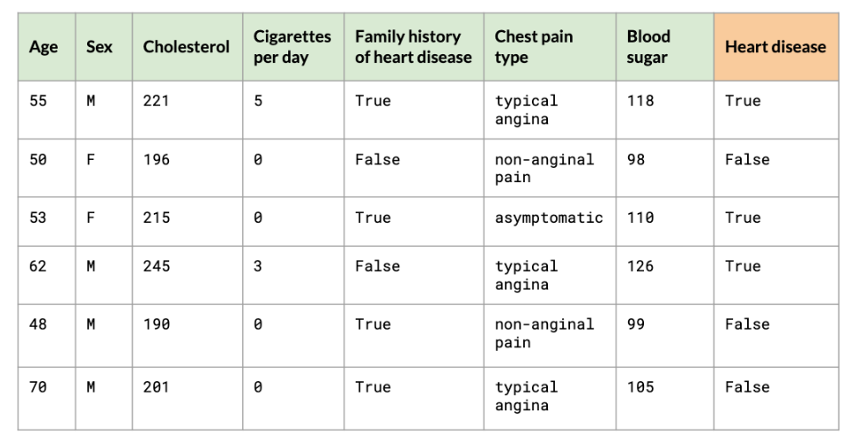
</div>

---

# Supervised learning: Target variable

<div align="center">
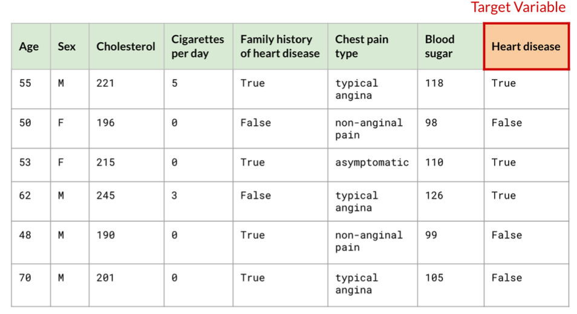
</div>

Target variable: what we want to predict (Heart disease)

---

# Supervised learning: Labels

<div align="center">
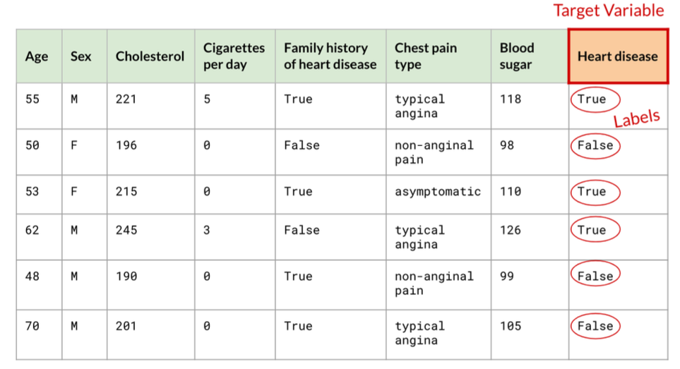
</div>

Labels: the actual values of the target variable in training data

---

# Supervised learning: Observations

<div align="center">
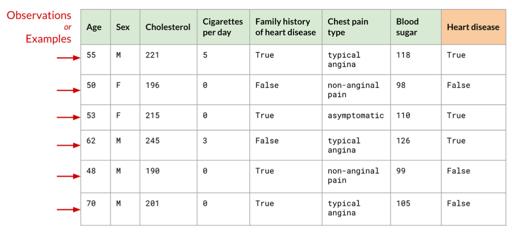
</div>

Observations (or Examples): individual rows of data

---

# Supervised learning: Features

<div align="center">
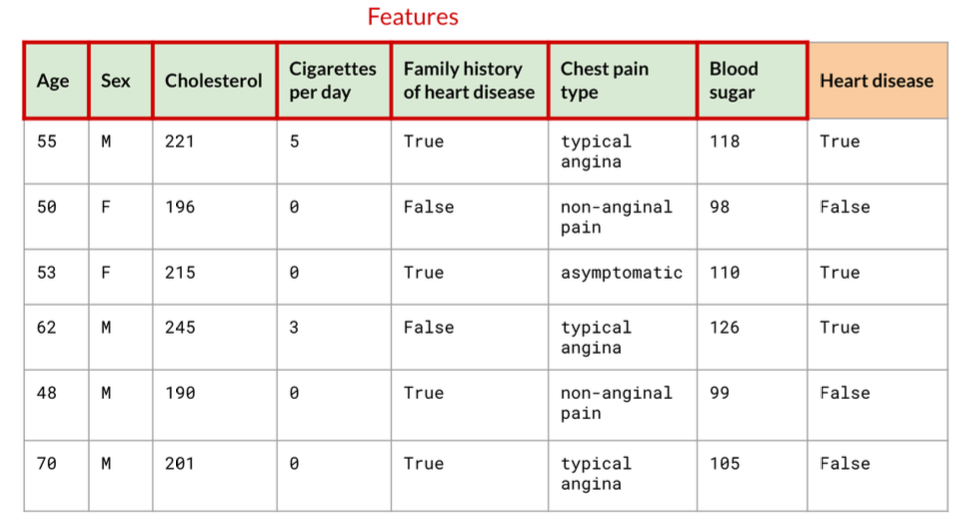
</div>

Features: input variables used to make predictions

---

# After training: Making predictions

<div align="center">
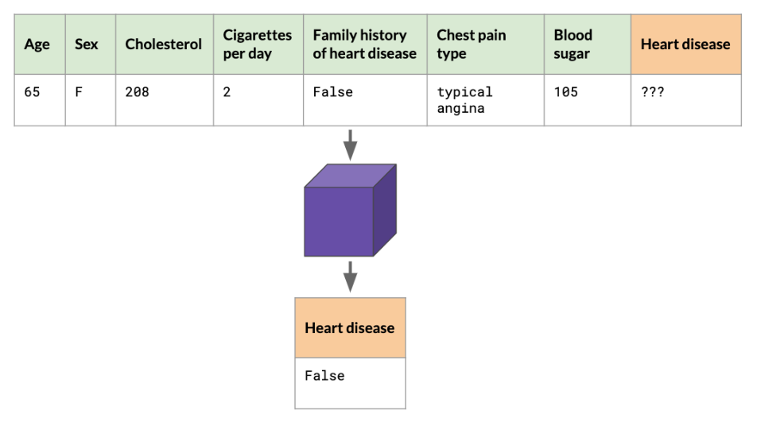
</div>

New patient data (without heart disease label) → Model → Prediction

---

# Supervised vs Unsupervised learning

.pull-left[
**Supervised learning**
- Training data is "labeled"
- Learn to predict target variable

**Unsupervised learning**
- Training data only has features
- No target variable
- Useful for:
  - Anomaly detection
  - Clustering (dividing data into groups)
]

.pull-right[
<div align="center">
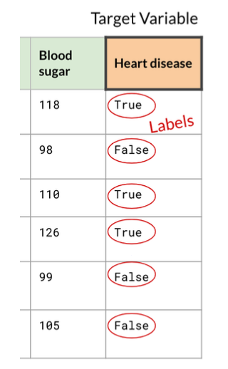
</div>
]

---

# Unsupervised learning: Example

<div align="center">
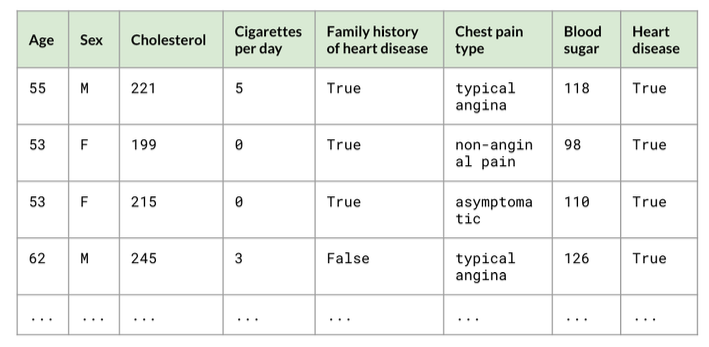
</div>

Finding patterns without labels

---

# Unsupervised learning: Clustering

<div align="center">
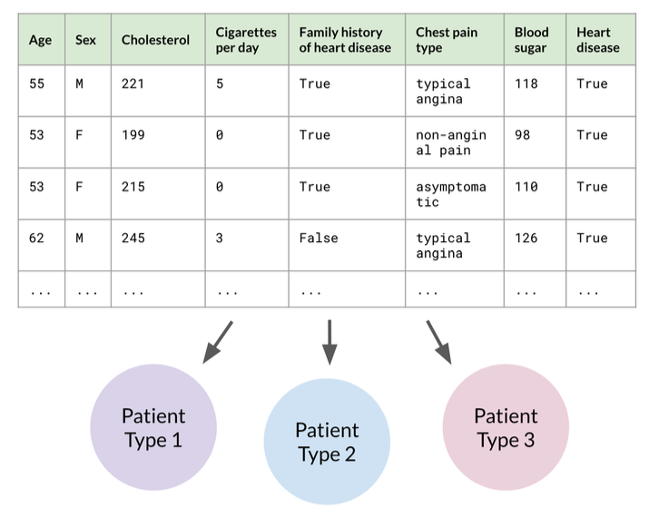
</div>

Model identifies patient types based on features

---

# After training: Unsupervised learning

<div align="center">
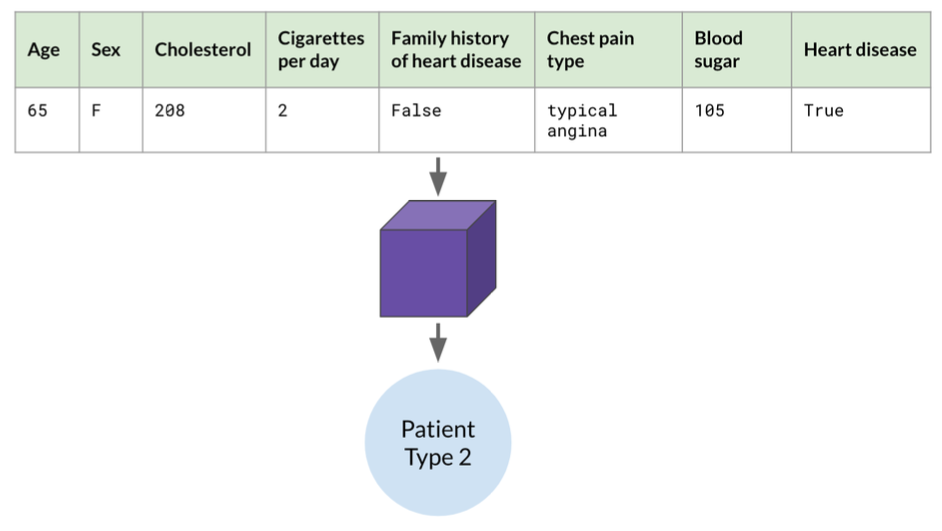
</div>

New patient → Model → Assigned to Patient Type 2

---

# Why unsupervised learning?

In reality, data doesn't always come with labels:

- Requires manual labor to label
- Labels are unknown
- Labels may not exist

No labels: model is unsupervised and finds its own patterns

---
class: center, middle

# Machine Learning Workflow

<html><div style='float:left'></div><hr color='#EB811B' size=1px width=1100px></html>

---

# Our scenario: NYC property sales

.pull-left[
<div align="center">

</div>
]

.pull-right[
**Our dataset:** NYC property sales from 2015-2019

**Includes:**
- Square feet
- Neighborhood
- Year built
- Sale price
- And more!

**Our target:** Sale price
]


---

# The workflow: Overview

<div align="center">
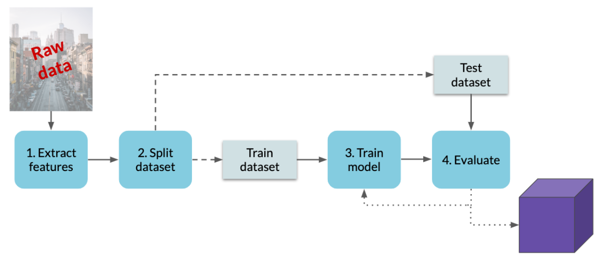
</div>

From historical data to trained model

---


# Evaluation

<div align="center">
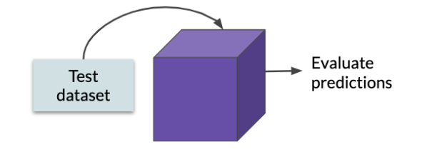
</div>

Use test dataset to evaluate model performance

---

# Evaluation: Is performance good enough?

<div align="center">
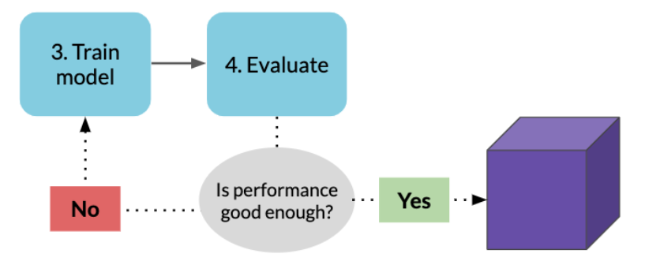
</div>

**Many ways to evaluate:**
- What is the average error of the predictions?
- What percent of apartments did the model accurately predict within a 10% margin?

If performance is good → Use model

If not → Tune and retrain

---

# Summary: ML workflow steps

**1. Extract features**
- Choosing features and manipulating the dataset

**2. Split dataset**
- Train and test dataset

**3. Train model**
- Input train dataset into a machine learning model

**4. Evaluate**
- If desired performance isn't reached: tune the model and repeat Step 3

---

class: center, middle, thank-you-slide
# Thanks!


`r fa('link')` [marcelortiz.com](https://marcelortiz.com/)

`r fa('envelope')` [marcelo.ortiz@emory.edu](mailto:marcelo.ortiz@emory.edu)

`r fa('twitter')` [@marcelortizv](https://twitter.com/marcelortizv)
